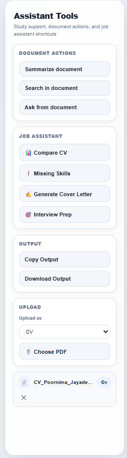

# Agentic AI Student Assistant

An intelligent **Agentic AI assistant** built with **FastAPI, Ollama, LangChain, FAISS, and Sentence Transformers**.

This project demonstrates practical **LLM application development**, **Retrieval-Augmented Generation (RAG)**, **backend engineering**, and **AI workflow orchestration** through a real-world portfolio application.

The assistant supports:

- Conversational AI chat
- PDF upload and document understanding
- Retrieval-Augmented Generation (RAG)
- Semantic search across uploaded files
- Document summarization
- CV vs Job Description comparison
- Cover letter generation
- Interview preparation
- Study planning workflows

---

# Features

## Core AI Chatbot

- Conversational AI powered by local LLMs
- Multi-turn chat support
- Short-term memory for contextual responses
- Intelligent task routing across workflows

## Document Intelligence

- Upload PDF files
- Extract text from PDFs
- Automatic text chunking
- Generate vector embeddings
- Store embeddings in FAISS vector database
- Ask questions from uploaded documents
- Semantic document retrieval
- Full document summarization

## Career Assistant

- Compare CV with Job Description
- Detect missing skills
- Generate tailored cover letters
- Create interview questions
- Interview preparation prompts

## Productivity Tools

- Study planner generation
- Calculator tool
- Personalized assistance workflows

## Frontend UI

- Responsive chat interface
- Sidebar tools
- Typing animation
- Message badges
- File preview before upload
- Active document workflow support

---

# Tech Stack

| Layer | Technology |
|------|------------|
| Backend | FastAPI |
| LLM | Ollama (Llama 3) |
| Framework | LangChain |
| Embeddings | Sentence Transformers |
| Vector Store | FAISS |
| PDF Parsing | PyPDF |
| Frontend | HTML, CSS, JavaScript |
| Language | Python |


---

# Project Structure

```bash
agentic-ai-student-assistant/
│── app/
│   ├── main.py
│   ├── routes/
│   ├── services/
│   ├── models/
│   └── utils/
│
│── static/
│   └── index.html
│
│── data/
│   ├── uploads/
│   ├── chunks/
│   ├── vectorstore/
│   └── memory/
│
│── screenshots/
│── requirements.txt
│── Dockerfile
│── README.md
```

---

# Architecture

```text
Frontend UI
   ↓
FastAPI Backend
   ↓
Agent Router
 ├── Chat Engine
 ├── RAG Engine
 ├── Tool Router
 ├── Planner
 ├── CV Comparison Agent
 └── Interview Prep Agent
   ↓
FAISS Vector Store
   ↓
Local LLM (Ollama + Llama 3)
```

---

# RAG Workflow

1. User uploads PDF  
2. Text extracted using PyPDF  
3. Document split into chunks  
4. Embeddings generated  
5. Stored in FAISS vector database  
6. User submits question  
7. Relevant chunks retrieved  
8. LLM generates final contextual response  

---

# Setup Instructions

## 1. Clone repository

```bash
git clone https://github.com/Poornima-Jayadevan/agentic-ai-student-assistant.git
cd agentic-ai-student-assistant
```

## 2. Create virtual environment

```bash
python -m venv venv
```

## 3. Activate Virtual Environment

### Windows

```bash
venv\Scripts\activate
```

### Mac/Linux

```bash
source venv/bin/activate
```

## 4. Install dependencies

```bash
pip install -r requirements.txt
```

## 5. Run Ollama

```bash
ollama run llama3
```

## 6. Start server

```bash
uvicorn app.main:app --reload
```

## 7. Open app

Frontend:

```bash
http://127.0.0.1:8000/static/index.html
```

Swagger docs:

```bash
http://127.0.0.1:8000/docs
```

---

# Screenshots

## Chat UI


## Sidebar Tools



## RAG Search


---

 Example Use Cases

- “Summarize this PDF”
- “Compare my CV with this job description”
- “Generate a cover letter for this role”
- “Prepare interview questions for Python Developer”
- “Create a study plan for my exams”
- “Search this uploaded document”

---

# Future Improvements

- User authentication
- Persistent database-backed memory
- Multiple user accounts
- Streaming responses
- Better ranking / reranking
- Cloud deployment
- React frontend
- Voice assistant support

---

# Why I Built This


I built this project to understand how modern AI assistants are designed in production environments using:

- Large Language Models (LLMs)
- Retrieval systems
- Semantic search
- FastAPI backend architecture
- Modular service design
- Agentic workflows
- Real-world AI product development

---

# Author

Poornima Jayadevan
