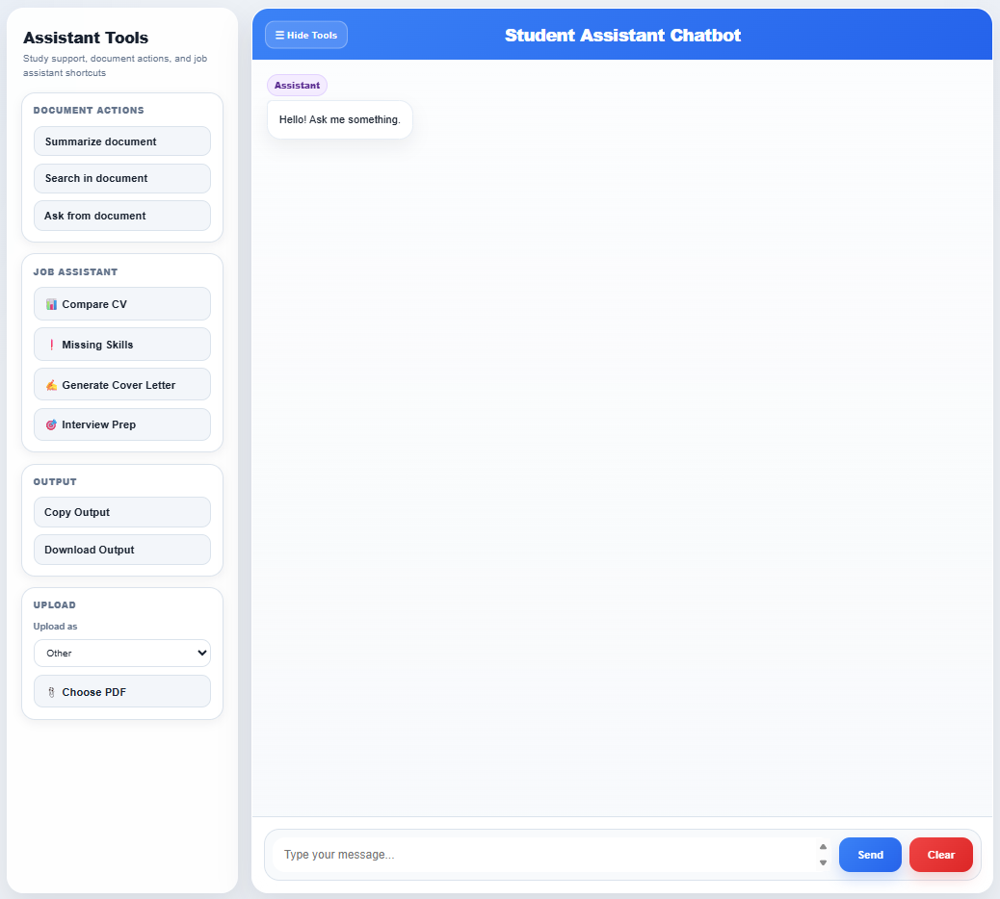
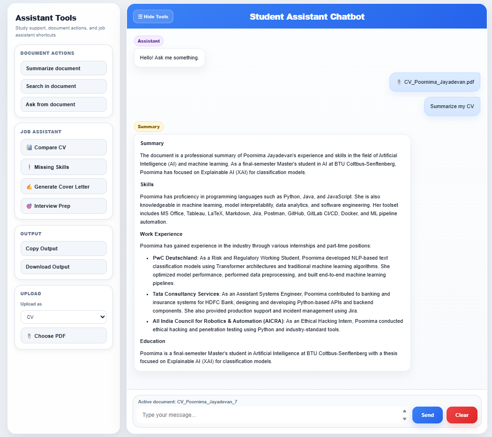

# Student Assistant Chatbot

An AI-powered chatbot built with **FastAPI**, **Ollama**, **FAISS**, and **Sentence Transformers** that supports:

- Conversational AI chat
- PDF upload and document understanding
- Retrieval-Augmented Generation (RAG)
- Semantic search across uploaded files
- Document summarization
- CV vs Job Description comparison
- Cover letter generation
- Interview preparation prompts

This project was built as a portfolio project to demonstrate practical **LLM application development**, **backend engineering**, and **RAG system design**.

---

# Features

## Core Chatbot
- Chat with an LLM through FastAPI backend
- Short-term conversation memory
- Multi-turn conversation support

## Document Intelligence
- Upload PDF files
- Extract text from PDFs
- Chunk long documents
- Generate embeddings
- Store vectors in FAISS
- Ask questions from uploaded documents
- Summarize documents
- Search documents semantically

## Job Assistant
- Compare CV with Job Description
- Find missing skills
- Generate cover letters
- Prepare interview questions

## UI
- Clean chat interface
- Sidebar tools
- Typing animation
- Message badges
- File preview before upload

---

# Tech Stack

| Layer | Technology |
|------|------------|
| Backend | FastAPI |
| LLM | Ollama (Llama 3) |
| Embeddings | Sentence Transformers |
| Vector Store | FAISS |
| PDF Parsing | PyPDF |
| Frontend | HTML, CSS, JavaScript |
| Language | Python |

---

# Project Structure

```bash
project/
│── app/
│   ├── main.py
│   ├── routes/
│   ├── services/
│   ├── models/
│   └── utils/
│
│── static/
│   └── index.html
│
│── data/
│   ├── uploads/
│   └── vectorstore/
│
│── README.md
```

---

# Architecture

## Flow

1. User uploads PDF  
2. Text extracted using PyPDF  
3. Text split into chunks  
4. Embeddings created  
5. Stored in FAISS vector DB  
6. User asks question  
7. Relevant chunks retrieved  
8. LLM generates final answer  

---

# Setup Instructions

## 1. Clone repository

```bash
git clone https://github.com/yourusername/student-assistant-chatbot.git
cd student-assistant-chatbot
```

## 2. Create virtual environment

```bash
python -m venv venv
```

## 3. Activate

### Windows

```bash
venv\Scripts\activate
```

### Mac/Linux

```bash
source venv/bin/activate
```

## 4. Install dependencies

```bash
pip install -r requirements.txt
```

## 5. Run Ollama

```bash
ollama run llama3
```

## 6. Start server

```bash
uvicorn app.main:app --reload
```

## 7. Open app

Frontend:

```bash
http://127.0.0.1:8000/static/index.html
```

Swagger docs:

```bash
http://127.0.0.1:8000/docs
```

---

# Screenshots

## Chat UI



## PDF Upload


## RAG Search



---

# Future Improvements

- User authentication
- Database-backed memory
- Multiple user accounts
- Better ranking / reranking
- Streaming responses
- React frontend
- Deployment to cloud

---

# Why I Built This

I built this project to learn how real-world AI assistants are developed using:

- LLM APIs
- Retrieval systems
- Semantic search
- FastAPI backend architecture
- Production-ready project structure

---

# Author

Poornima Jayadevan